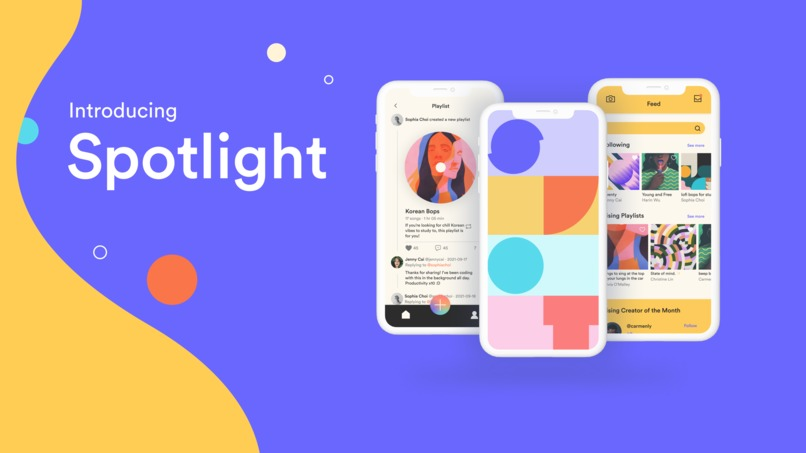

# Spotlight - Pinnacle 2021

## Devpost
https://devpost.com/software/spotlight-f1w5k6

## Inspiration
The experience of enjoying music is deeply personal, but it doesn’t have to be done in isolation. Current music streaming platforms like Spotify are very limited in allowing users to interact with one another—it is extremely difficult to discover new music that you actually like or stay up to date with your friends’ evolving music tastes.

We identified the following problems to design our solution around:

Hidden gems - Spotify only promotes Spotify-curated playlists, which are dominated only by top-paid artists. As a result, less popular artists do not get discovered. Low-played and low-payed tracks are forgotten and hidden, almost impossible to find unless users know exactly what to search.

Isolation - Users are disconnected from each other, unable to meaningfully interact with one another on the platform. It is extremely difficult to stay up to date with your friends' evolving music tastes.

Ice breaker - Friendships can be sparked by shared tastes in music—but there is no quick way to discover new users (and playlists) to follow on current music streaming platforms.

## What it does
Spotlight is a music extension app for Spotify; We focus on highlighting the authentic experience of discovering by spotlighting real user’s musical footprints. From listeners to artists, people can discover and share their unique curated playlists while sparking new friendships through shared taste in music. Each of the three following key features is designed to tackle one aforementioned issue users encounter on current streaming platforms:

Discover - Sick of listening to Top 50? Discover authentic user-generated playlists and new songs curated across the globe.

Community - Interact with Spotify users like you never have before, and send music directly to your feed or private inbox!

Compatibility - With compatibility scores, you can spark friendships by a shared taste in music. And yes, we promise, it’s better than Tinder.

## How we built it
This project was built with our first hackathon all-nighter. We were late on our ideation, finalizing our idea 4 hours into the hackathon. We then decided to use a trusty full stack setup: MySQL database, Python FastAPI server, and a Swift UI frontend iOS app. We also decided to include some unique technical features, including docker-compose and our unique hybrid ML model. We created a docker-compose set up to allow our two developers to share an identical dev environment, with an easy "docker-compose up" command to start the database and server. This also includes initialization of mock data, tables and stored procedures. The setup allowed us to explore various hosting options including Raspberry Pi/Jetson Nano (unfortunately we had no ethernet), and allowed us to ultimately deploy on GCP. We also built a recommendation engine that combines algorithms with human intelligence. The app discovers users similar to you through a cosine similarity algorithm, this data is then stored on our database for fast inference. The parameters used include variables like danceability, tempo, speechiness and 7 more, all extracted from Spotify. We then pull top playlists from these users from our database to ultimately provide a mixed recommendation for the user. In addition, we apply the same technique from a user to all the playlists in our database, providing a raw algorithmic suggestion.

## Challenges we ran into
A big problem we had was in the final 8 hours of the competition. We started encountering many minor issues as we got tired, including minute details like missed semi-colon, typos, and our personal favorite: using the wrong email address in the dev console (denying us access for an hour). However, given the time constraint and difficult circumstances, our team was able to pull an all-nighter and complete the app before the deadline.

## Accomplishments that we're proud of
Pinnacle will be the last hackathon for all four of us, so we are really proud to get together and build one last time.

## If we had more time
We would improve the user flow and build out a chat function that allows users to send music to each other without leaving the app.

